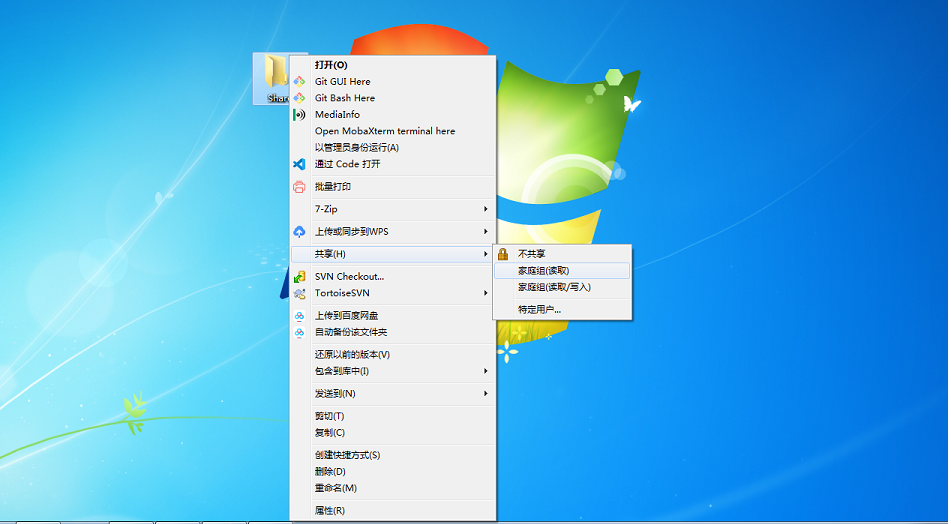
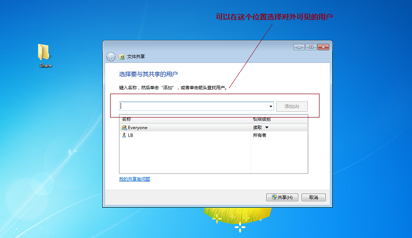
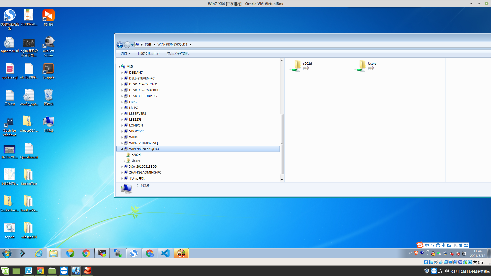
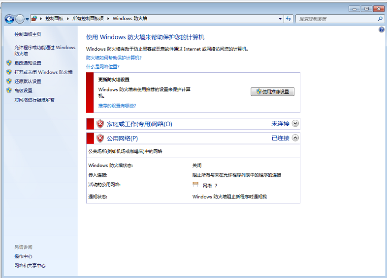
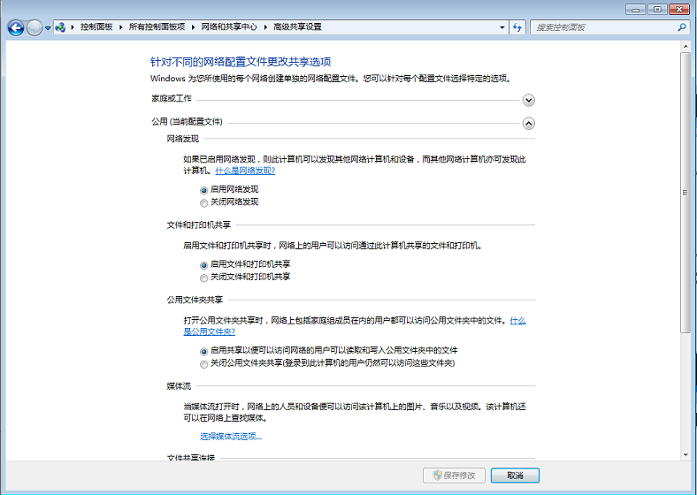
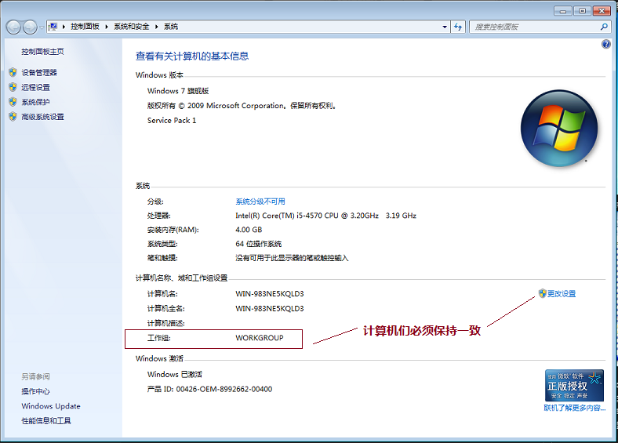
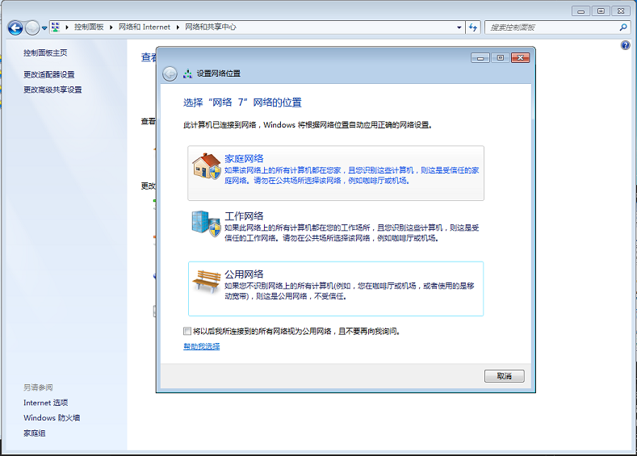

## **window 共享文件夹挂载到linux上**
> [相关链接](!https://blog.csdn.net/tojohnonly/article/details/71374984)

### **1. window 设置共享文件夹** 
- 创建文件，右键选择分享

- 设置文件分享给哪用户可见

- 在其他电脑查看是否分享成功


### **2. window 设置常见问题**
- 开启了防火墙导致分享失败  
      
    
- 没有设置共享可见  
    
- 共享文件的组别不对
    1. 计算机们必须在同一工作组下【查看工作组：我的电脑 - 属性】
       
    2. 计算机所在的网络要在同一组内
       

- 无法访问或者指定的密码不正确
    1. 修改网络安全设置
    ```sh
    # 修改网络安全设置 : 开始 -> 运行 gpedit.msc , 打开组策略 -> 计算机配置 -> Windows设置 -> 安全设置 -> 本地策略 -> 安全选项 -> 选择 “网络安全 : LAN 管理器身份验证级别” , 双击打开 , 设置成“发送 LM 和 NTLM 响应” ;
    ```
    2. 修改网络访问模型
    ```sh
    # 修改网络访问模型 : 开始 -> 运行 -> gpedit.msc -> 计算机配置 -> Windows设置 -> 安全设置 -> 本地策略 -> 安全选项 -> 选择 “网络访问:本地帐户的共享和安全模型” , 修改为使用经典模式 ;
    ```

### **1. Linux 挂载文件** 
- 挂载window共享文件: mount -t cifs -o username=Bob,password=123456 //192.168.0.102/Share /usr/local/bin/code
- 查看挂载状态：mount 
- 卸载共享文件：umount /usr/local/bin/code


